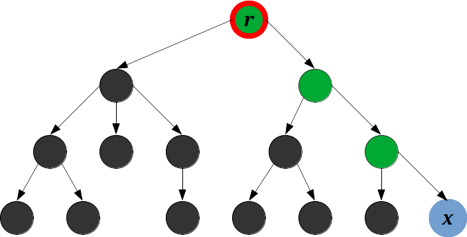

# Algorithm Analysis

Table of Contents
=================

* [Algorithm Analysis](#algorithm-analysis)
   * [1. Repository description](#1-repository-description)
   * [2. Acknowledgments](#2-acknowledgments)

Created by [gh-md-toc](https://github.com/ekalinin/github-markdown-toc)

## 1. Repository description

This project provides homework solutions for the Algorithm Analysis course
taught at [Politehnica University of Bucharest](https://upb.ro), during the
first semester of the university year 2020-2021.

I created this repository for the following reasons:

1. the huge efforts I put in the [LCA Analysis](homework/1)
2. personal interest in the suject

For more information or a syllabus check out the course description
[page here](https://cs.pub.ro/index.php/education/courses/59-under/an2under/109-algorithms-analysis)
. This course was taught by Ștefan Trăușan-Matu.

## 2. Acknowledgments

I would like to thank
[Radu Cristian Alexandru Iacob](https://github.com/johnthebrave) and prof.
Trășan-Matu for all their support. They really opened new doors for me.
